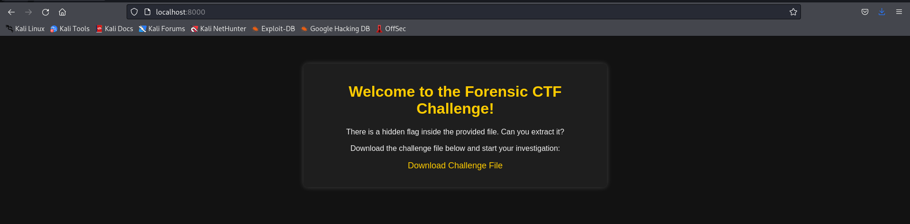
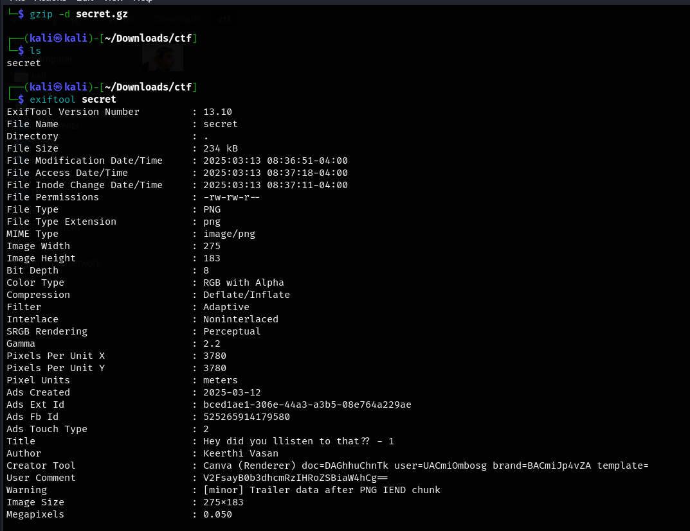
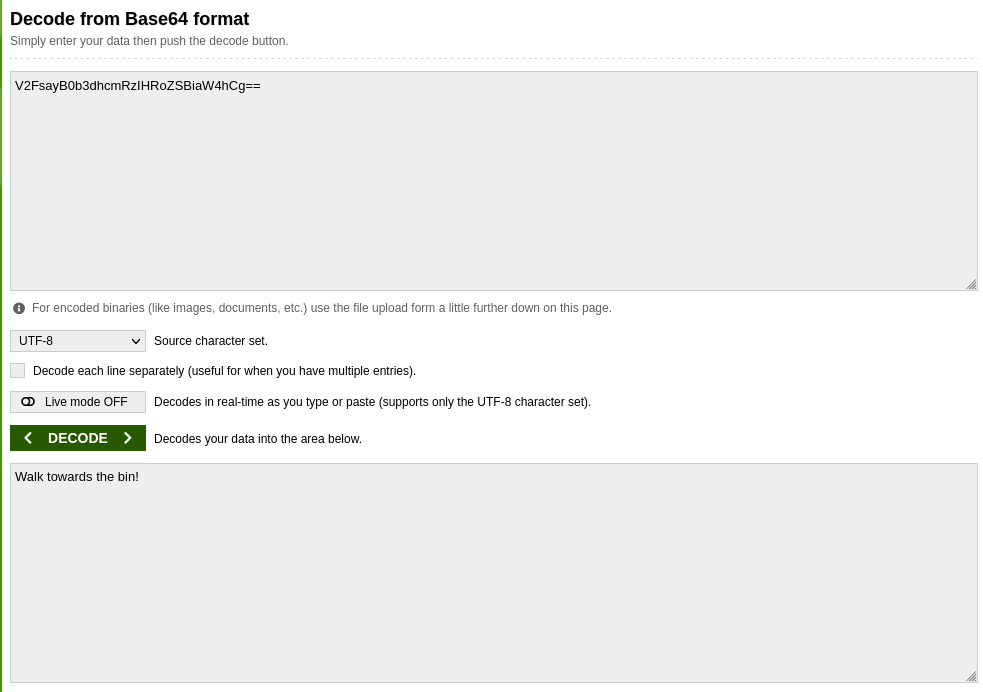
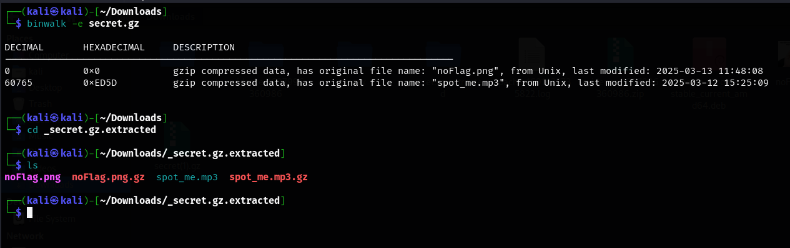
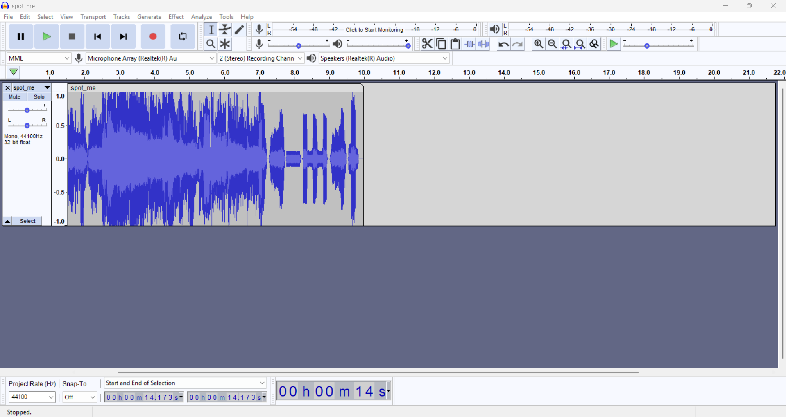
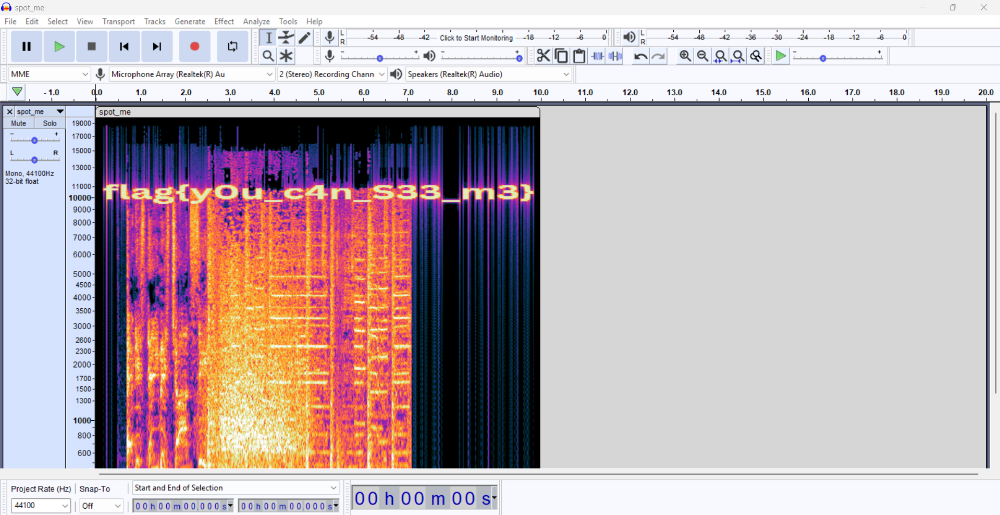

# Solution to solve the challenge

## Download the challenge file.

## Extract the downloaded file

- We get a file named secret which is an image.
- Ok we got a message here “Hey did you listen to that??”.
- Use ExifTool to display the meta data.
- We have an encoded text in the user comments.

## Now lets decode the text which seems to be base64 encoded.

- “Walk toward the bin.” - This maybe a hint to use binwalk

Using Binwalk to extract the hidden files

- We got a hidden file named spot_me.mp3
- Now the message “hey did you listen to that make sense.”

## Open the mp3 file in a music visualizer like audacity/sonic visualiser

- We have an audio clip of JOHN CENA’s entrance music!

## Change the view from waveform to spectrogram

- Here we go - flag{y0u_c4n_s33_m3} :)
